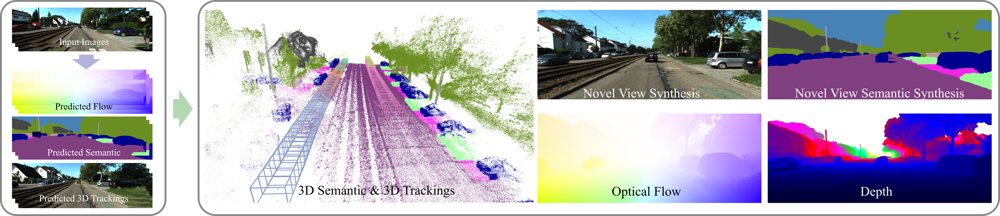

# HUGS: Holistic Urban 3D Scene Understanding via Gaussian Splatting

[Hongyu Zhou](https://github.com/hyzhou404), [Jiahao Shao](https://jhaoshao.github.io/), Lu Xu, Dongfeng Bai, [Weichao Qiu](https://weichaoqiu.com/), Bingbing Liu, [Yue Wang](https://ywang-zju.github.io/), [Andreas Geiger](https://www.cvlibs.net/) , [Yiyi Liao](https://yiyiliao.github.io/)<br>

| [Webpage](https://xdimlab.github.io/hugs_website/) | [Full Paper](https://openaccess.thecvf.com/content/CVPR2024/html/Zhou_HUGS_Holistic_Urban_3D_Scene_Understanding_via_Gaussian_Splatting_CVPR_2024_paper.html) | [Video](https://www.youtube.com/watch?v=DmPhL-8FeT4)

This repository contains the official authors implementation associated with the paper "HUGS: Holistic Urban 3D Scene Understanding via Gaussian Splatting", which can be found [here](https://xdimlab.github.io/hugs_website/). 



Abstract: *Holistic understanding of urban scenes based on RGB images is a challenging yet important problem. It encompasses understanding both the geometry and appearance to enable novel view synthesis, parsing semantic labels, and tracking moving objects. Despite considerable progress, existing approaches often focus on specific aspects of this task and require additional inputs such as LiDAR scans or manually annotated 3D bounding boxes. In this paper, we introduce a novel pipeline that utilizes 3D Gaussian Splatting for holistic urban scene understanding. Our main idea involves the joint optimization of geometry, appearance, semantics, and motion using a combination of static and dynamic 3D Gaussians, where moving object poses are regularized via physical constraints. Our approach offers the ability to render new viewpoints in real-time, yielding 2D and 3D semantic information with high accuracy, and reconstruct dynamic scenes, even in scenarios where 3D bounding box detection are highly noisy. Experimental results on KITTI, KITTI-360, and Virtual KITTI 2 demonstrate the effectiveness of our approach.*


## Cloning the Repository

The repository contains submodules, thus please check it out with 
```shell
# SSH
git clone git@github.com:hyzhou404/hugs.git --recursive
```
or
```shell
# HTTPS
git clone https://github.com/hyzhou404/hugs --recursive
```


## Prepare Enviroments

Create conda environment:

```shell
conda create -n hugs python=3.10 -y
```

Please install [PyTorch](https://pytorch.org/), [tiny-cuda-nn](https://github.com/NVlabs/tiny-cuda-nn), [pytorch3d](https://github.com/facebookresearch/pytorch3d/tree/main) and [flow-vis-torch](https://github.com/ChristophReich1996/Optical-Flow-Visualization-PyTorch) by following official instructions.

Install submodules by running:

```shell
pip install submodules/simple-knn
pip install submodules/hugs-rasterization
```

Install remaining packages by running:
 ```shell
 pip install -r requirements.txt
 ```


## Data & Checkpoints Download

we have made available two sequences from KITTI as indicated in our paper. Furthermore, three sequences from KITTI-360 and one sequence from Waymo has also been provided.

Download checkpoints from [here](https://huggingface.co/datasets/hyzhou404/hugs_release).

```python
unzip ${sequence}.zip
```


## Rendering

Render test views by running:

```shell
python render.py -m ${checkpoint_path} --data_type ${dataset_type} --iteration 30000 --affine  
```

The variable **dataset_type** is a string, and its value can be one of the following: **kitti**, **kitti360**, or **waymo**.


## Evaluation

```
python metrics.py -m ${checkpoint_path}
```

## Training
This repository only includes the inference code of HUGS. The code for training will be released in future work.


<section class="section" id="BibTeX">
  <div class="container is-max-desktop content">
    <h2 class="title">BibTeX</h2>
    <pre><code>@InProceedings{Zhou_2024_CVPR,
    author    = {Zhou, Hongyu and Shao, Jiahao and Xu, Lu and Bai, Dongfeng and Qiu, Weichao and Liu, Bingbing and Wang, Yue and Geiger, Andreas and Liao, Yiyi},
    title     = {HUGS: Holistic Urban 3D Scene Understanding via Gaussian Splatting},
    booktitle = {Proceedings of the IEEE/CVF Conference on Computer Vision and Pattern Recognition (CVPR)},
    month     = {June},
    year      = {2024},
    pages     = {21336-21345}
    }</code></pre>
  </div>
</section>
